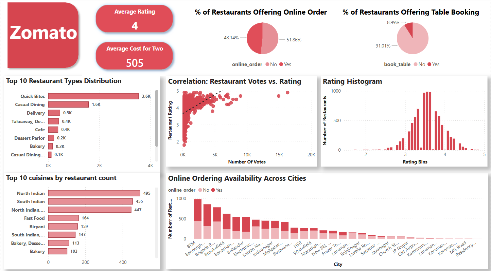

# Zomato Restaurant Data Analysis Dashboard

## Project Overview

This Power BI dashboard provides an in-depth analytical view of Zomato restaurant data, offering valuable insights into restaurant trends, performance metrics, and customer preferences across various cities and restaurant categories. The primary goal of this project is to transform raw, messy Zomato data into actionable intelligence, enabling users to explore patterns related to cost, ratings, cuisines, and service types, ultimately aiding in understanding the restaurant landscape.

## Key Features & Insights

* **Cuisine Popularity & Trends:** Identify the most prevalent and highest-rated cuisine types, understanding their distribution and performance.
* **Rating & Review Performance:** Analyze average ratings, the distribution of ratings, and the potential impact of customer reviews on restaurant success.
* **Restaurant Type Breakdown:** Explore the characteristics and performance metrics of different restaurant types (e.g., Casual Dining, Quick Bites, Cafes, Delivery Only).
* **Service Category Insights:** Differentiate trends and restaurant behavior based on their primary service offerings, such as online ordering availability, table booking options, and delivery services.

## Technologies Used

* **Microsoft Power BI Desktop:** The primary tool for data modeling, creating interactive visualizations, designing the dashboard layout, and writing Data Analysis Expressions (DAX).
* **Power Query (M Language):** Extensively utilized for robust data extraction, transformation, and loading (ETL) processes. This includes advanced data cleaning, type conversions, and sophisticated imputation techniques.
* **Pandas (Conceptual):** The complex data cleaning and imputation logic (especially for handling missing values using group-wise medians and modes) was inspired by powerful operations typically performed in Python's Pandas library, meticulously translated and implemented within Power Query's M language.

## Data Source
The dataset used for this analysis is sourced from Zomato, containing comprehensive information on a multitude of restaurants, including their names, types, online order and table booking availability, ratings, number of votes, locations, cuisines served, estimated cost for two, and service categories.

## Data Transformation & Cleaning Highlights
A significant portion of this project involved meticulous data cleaning and preparation within Power Query to ensure the highest quality and accuracy of data for analysis. Key transformation and imputation steps include:

* **Handling Missing Values (Advanced Imputation):**
    * **`Cost_for_two`:** Missing numerical cost values were intelligently imputed using a **two-level median imputation strategy**.
        1.  First, `null` values were filled with the median `Cost_for_two` from restaurants sharing the **same `City` AND `rest_type`**.
        2.  Any remaining `null`s were then filled using the median `Cost_for_two` from restaurants sharing the **same `City` AND `Service_Category`**.
        This ensures contextually relevant numerical imputation.
    * **`cuisines`:** Missing categorical cuisine entries were filled using a **two-level mode imputation strategy**.
        1.  Initially, `null` values were filled with the most frequent `cuisine` (mode) from restaurants within the **same `City` AND `rest_type`** group.
        2.  Any still-missing values were subsequently imputed with the mode of the `cuisines` within the **same `City` AND `Service_Category`** group.
        This approach preserves the typical cuisine pattern for categorical data.
    * **`Rating_out_of_5`:** Missing numerical rating values were imputed using a **two-level median imputation strategy**.
        1.  First, `null`s were filled with the median `Rating_out_of_5` from restaurants belonging to the **same `City`, `cuisines`, AND `rest_type`** group.
        2.  Any remaining `null`s were then filled using the broader median `Rating_out_of_5` from the **`City`** group alone.
    * Custom Power Query functions (`fGetMode`, `fGetMedian`) were developed to robustly handle edge cases within groups, such as lists with no non-null values or ties in mode calculation, preventing errors during imputation.

* **Data Type Conversions:** Ensuring all columns were correctly typed (e.g., `Cost_for_two` and `Rating_out_of_5` to decimal numbers, `votes` to whole numbers, and `cuisines` to text).
* **Error Handling:** Implementing strategies to gracefully handle errors during data transformation, converting them to `null` where appropriate for further imputation.

## How to Use/View
1.  **Clone this repository:**
    ```bash
    git clone [https://github.com/Kishalini-s/Zomato-PowerBI-Dashboard.git]
    ```
2.  **Open the `.pbix` file:** Download the `Zomato_Dashboard.pbix`and open it using Power BI Desktop.
3.  **Refresh Data:** Upon opening, Power BI Desktop might prompt you to refresh the data. Click 'Refresh' to load the latest data into the model. Ensure you have network access if the data source is web-based, or that the local file path (if applicable) for the dataset is correctly configured.
4.  **Explore Insights:** Interact with the filters on the dashboard to explore the restaurant data and gain insights.

## Dashboard Screenshot


--------------------------------------------------------------------------------------------------------------
